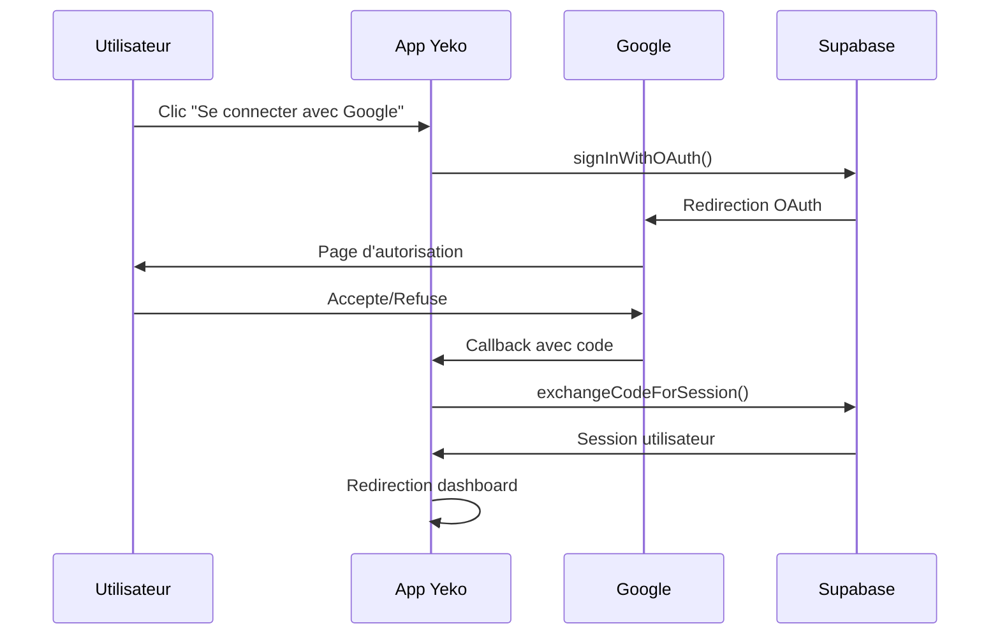
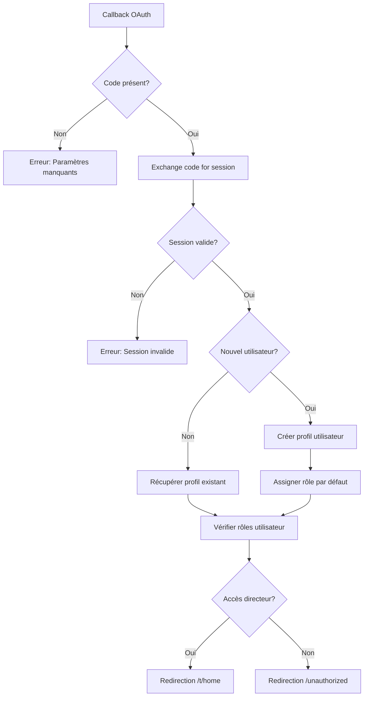

# 🔐 Documentation OAuth Google - Yeko Pro

Cette documentation décrit l'implémentation complète de l'authentification OAuth Google dans l'application Yeko Pro.

## 📋 Vue d'ensemble

L'authentification OAuth Google permet aux utilisateurs de se connecter ou de s'inscrire en utilisant leur compte Google, offrant une expérience utilisateur fluide et sécurisée.

### ✨ Fonctionnalités implémentées

- ✅ Connexion avec Google
- ✅ Inscription avec Google
- ✅ Gestion des erreurs OAuth
- ✅ Interface utilisateur cohérente
- ✅ Support responsive et dark mode
- ✅ Tests unitaires complets

## 🏗️ Architecture

### Structure des fichiers

```
├── types/index.ts                     # Types OAuth & Google Profile
├── services/oauthService.ts           # Logique métier OAuth
├── hooks/useGoogleAuth.ts            # Hook personnalisé React
├── components/
│   ├── GoogleSignInButton.tsx        # Composant bouton principal
│   └── OAuthErrorBoundary.tsx        # Gestion des erreurs
├── app/(auth)/
│   ├── callback/page.tsx             # Page de callback OAuth
│   └── _components/
│       ├── LoginForm.tsx             # Formulaire connexion (modifié)
│       └── SignUpForm.tsx            # Formulaire inscription (modifié)
└── __tests__/                        # Tests unitaires
```

### Types principaux

```typescript
interface GoogleProfile {
  sub: string
  email: string
  name: string
  picture: string
  given_name: string
  family_name: string
  email_verified: boolean
  locale?: string
}

interface OAuthResult {
  success: boolean
  user?: IUserProfileDTO
  error?: string
  isNewUser?: boolean
}
```

## 🔧 Configuration

### 1. Variables d'environnement

Ajoutez à votre `.env.local` :

```bash
# Google OAuth Client ID (public)
NEXT_PUBLIC_GOOGLE_CLIENT_ID=your_google_client_id.apps.googleusercontent.com
```

### 2. Configuration Google Cloud Console

1. **Accédez à Google Cloud Console**
   - Créez un nouveau projet ou sélectionnez un existant

2. **Activez l'API Google OAuth 2.0**
   ```
   APIs & Services > Library > Google+ API (Enable)
   ```

3. **Créez des credentials OAuth 2.0**
   ```
   APIs & Services > Credentials > Create Credentials > OAuth 2.0 Client ID
   ```

4. **Configurez les domaines autorisés**
   ```
   Authorized JavaScript origins:
   - http://localhost:3000 (development)
   - https://your-domain.com (production)

   Authorized redirect URIs:
   - http://localhost:3000/auth/callback (development)
   - https://your-domain.com/auth/callback (production)
   ```

### 3. Configuration Supabase

1. **Accédez au dashboard Supabase**
   - Allez dans Authentication > Settings > Auth Providers

2. **Activez Google Provider**
   ```
   Google enabled: ON
   Client ID: [votre_google_client_id]
   Client Secret: [votre_google_client_secret]
   Redirect URL: https://[projet].supabase.co/auth/v1/callback
   ```

## 🚀 Utilisation

### Composant GoogleSignInButton

```tsx
import { GoogleSignInButton, SocialAuthDivider } from '@/components/GoogleSignInButton'

// Bouton de connexion
<GoogleSignInButton
  mode="signin"
  className="w-full"
  size="lg"
  onAuthAttempt={(success) => {
    if (success) {
      console.log('Authentification initiée')
    }
  }}
/>

// Séparateur
<SocialAuthDivider />

// Bouton d'inscription
<GoogleSignInButton
  mode="signup"
  className="w-full"
/>
```

### Hook useGoogleAuth

```tsx
import { useGoogleAuth } from '@/hooks/useGoogleAuth'

function MyComponent() {
  const {
    googleSignIn,
    googleSignUp,
    isLoading,
    error,
    clearError
  } = useGoogleAuth()

  const handleGoogleLogin = async () => {
    const success = await googleSignIn()
    if (success) {
      // Redirection automatique
    }
  }

  return (
    <div>
      {error && (
        <div className="error">
          {error.message}
          <button type="button" onClick={clearError}>Fermer</button>
        </div>
      )}

      <button
        type="button"
        onClick={handleGoogleLogin}
        disabled={isLoading}
      >
        {isLoading ? 'Connexion...' : 'Se connecter'}
      </button>
    </div>
  )
}
```

### Service OAuth directement

```tsx
import { createUserFromGoogleProfile, signInWithGoogle } from '@/services/oauthService'

// Initier la connexion OAuth
const result = await signInWithGoogle({
  redirectTo: '/custom-callback',
  scopes: ['email', 'profile']
})

if (result.success && result.url) {
  window.location.href = result.url
}
```

## 🎨 Gestion des erreurs

### Types d'erreurs OAuth

```typescript
interface OAuthError {
  code: string
  message: string
  details?: Record<string, unknown>
}
```

### Codes d'erreur courants

- `access_denied` - Utilisateur a refusé l'autorisation
- `invalid_request` - Requête OAuth malformée
- `network_error` - Problème de connexion réseau
- `popup_blocked` - Popup bloquée par le navigateur
- `server_error` - Erreur temporaire du serveur

### Composant de gestion d'erreur

```tsx
import { OAuthErrorDisplay, useOAuthErrorHandler } from '@/components/OAuthErrorBoundary'

function MyForm() {
  const { renderError, handleRetry } = useOAuthErrorHandler()

  return (
    <div>
      {/* Rendu automatique des erreurs */}
      {renderError('inline', {
        mode: 'signin',
        showRetry: true
      })}

      {/* Ou composant personnalisé */}
      <OAuthErrorDisplay
        error={error}
        variant="card"
        onRetry={() => handleRetry('signin')}
      />
    </div>
  )
}
```

## 🔄 Flux d'authentification

### 1. Connexion OAuth



### 2. Traitement du callback



## 🧪 Tests

### Lancer les tests

```bash
# Tests unitaires
npm run test

# Tests avec interface
npm run test:ui

# Tests de couverture
npm run test -- --coverage
```

### Tests implémentés

- ✅ Service OAuth (oauthService.test.ts)
- ✅ Composant GoogleSignInButton
- ✅ Gestion des erreurs
- ✅ Hooks personnalisés
- ✅ Intégration callback

## 🔒 Sécurité

### Bonnes pratiques implémentées

1. **Variables d'environnement**
   - Client ID public exposé côté client
   - Secret conservé côté Supabase uniquement

2. **Validation des données**
   - Vérification des paramètres OAuth
   - Validation des profils Google
   - Gestion des erreurs robuste

3. **Gestion des sessions**
   - Sessions Supabase sécurisées
   - Tokens avec expiration automatique
   - Refresh tokens gérés par Supabase

4. **Redirection sécurisée**
   - URLs de callback whitelistées
   - Validation des paramètres d'état
   - Protection CSRF intégrée

## 🐛 Dépannage

### Problèmes courants

#### 1. "OAuth provider not configured"
```bash
# Vérifiez votre configuration Supabase
# Auth > Settings > Auth Providers > Google
```

#### 2. "Redirect URI mismatch"
```bash
# Vérifiez les URLs dans Google Cloud Console
# Authorized redirect URIs doivent correspondre exactement
```

#### 3. "Popup blocked"
```bash
# Demandez à l'utilisateur d'autoriser les popups
# Ou implémentez une redirection full-page
```

#### 4. Variables d'environnement manquantes
```bash
# Vérifiez .env.local
NEXT_PUBLIC_GOOGLE_CLIENT_ID=votre_client_id
```

### Debugging

```tsx
// Activer les logs de débogage
import { createClient } from '@/lib/supabase/client'

const supabase = createClient()
supabase.auth.onAuthStateChange((event, session) => {
  console.log('Auth event:', event, session)
})
```

## 📊 Monitoring

### Métriques à surveiller

- Taux de conversion OAuth
- Erreurs d'authentification
- Temps de réponse des callbacks
- Échecs de création d'utilisateur

### Logs utiles

```typescript
// Dans oauthService.ts
console.log('OAuth success rate:', successRate)
console.log('Common error codes:', errorCodes)
```

## 🔄 Maintenance

### Mises à jour régulières

1. **Tokens d'accès Google**
   - Surveillance de l'expiration
   - Renouvellement automatique via Supabase

2. **URLs de callback**
   - Vérification lors des déploiements
   - Mise à jour des domaines autorisés

3. **Dépendances**
   - Mise à jour de Supabase Auth
   - Tests de régression OAuth

---

## 📞 Support

Pour toute question ou problème lié à l'implémentation OAuth :

1. Consultez cette documentation
2. Vérifiez les logs d'erreur
3. Testez la configuration Supabase
4. Validez les paramètres Google Cloud Console

L'implémentation suit les meilleures pratiques de sécurité et les standards OAuth 2.0 / OpenID Connect.
